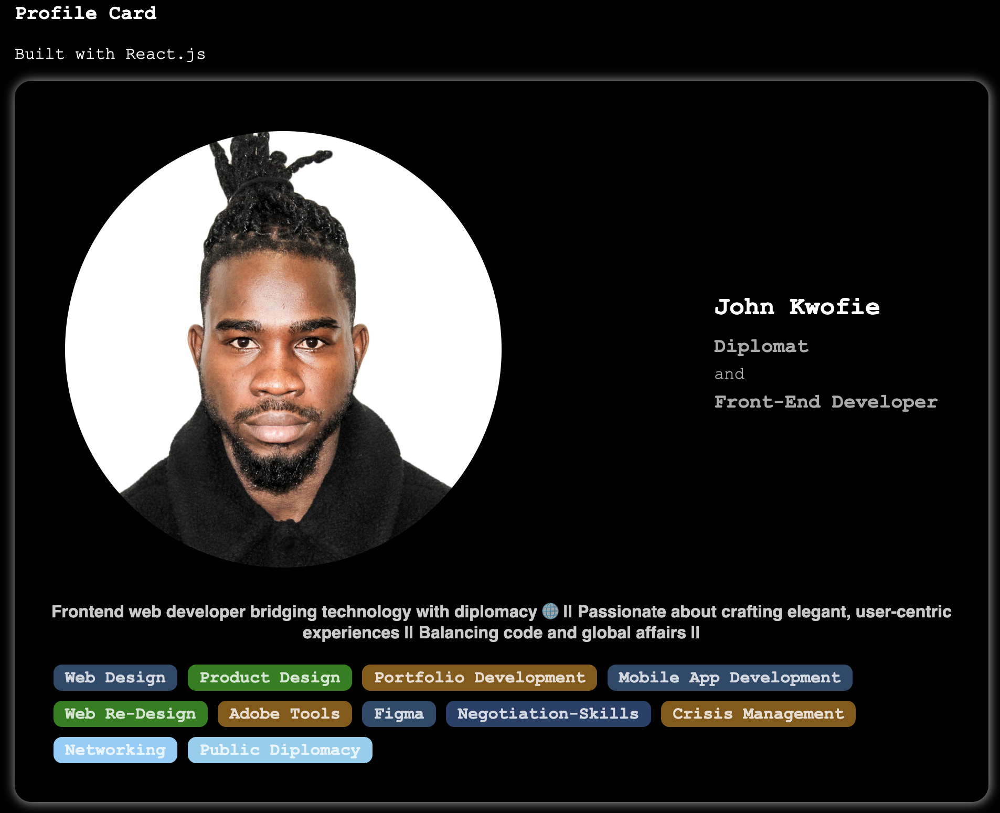

# My Profile Card



## Introduction

Welcome to my Profile Card project! This project features a stylish and interactive profile card built using React. The card highlights my dual roles as a diplomat and a front-end developer.

## Features

- **Interactive Design**: The profile card is designed with modern front-end technologies, ensuring a responsive and engaging user experience.
- **Diplomat Profile**: Showcasing my professional journey and achievements as a diplomat.
- **Front-End Developer**: Highlighting my skills, projects, and contributions in the field of front-end development.

## Installation

To install and run this project locally, follow these steps:

1. **Clone the Repository**:
    ```bash
    git clone https://github.com/johnyREx/profile_card.git
    cd profile-card-project
    ```

2. **Install Dependencies**:
    ```bash
    npm install
    ```

3. **Start the Development Server**:
    ```bash
    npm start
    ```

The development server will start on `http://localhost:3000`, and you can view the profile card in your browser.

## Usage

This project serves as a portfolio piece and can be extended to include more details about my professional and personal achievements. Feel free to explore and modify the code to suit your needs.

## Contributing

Contributions are welcome! If you would like to contribute to this project, please fork the repository and submit a pull request with your changes. Make sure to include a detailed description of what you have done.

## License

This project is licensed under the MIT License. See the `LICENSE` file for more details.

## Contact

If you have any questions or would like to connect, feel free to reach out:

- **Email**: [johnkowfie99@outlook.com](mailto:johnkowfie99@outlook.com)
- **Twitter**: [My Twitter Profile](https://www.x.com/in/thejohnyrex)

Thank you for checking out my Profile Card project!